Genomics of Drug Sensitivity in Cancer (GDSC) Project
================
Sam Scott, Megan Lee, Titus Sun
2026-06-01

``` r
library(caret)
library(tidyverse)
library(kernlab)
library(dplyr)
library(tibble)
library(mlbench)
library(randomForest)
library(corrplot)
library(ggplot2)
#install.packages("patchwork", repos = "https://cloud.r-project.org")
#url("https://cloud.r-project.org")
#options(download.file.method = "wininet")
#install.packages("patchwork", repos = "https://cloud.r-project.org")
library(patchwork)
library(Hmisc)
library(e1071)
library(doParallel)
library(kknn)
library(earth)
```

# a way to read the dataset off of github so no need for local machine calls

``` r
data_url <- "https://raw.githubusercontent.com/sascott9655/GDSC-Project/refs/heads/main/GDSC_DATASET.csv"
data  <- read.csv(data_url)
```

``` r
str(data)
```

    ## 'data.frame':    242035 obs. of  19 variables:
    ##  $ COSMIC_ID                              : int  683667 684057 684059 684062 684072 687448 687452 687455 687457 687459 ...
    ##  $ CELL_LINE_NAME                         : chr  "PFSK-1" "ES5" "ES7" "EW-11" ...
    ##  $ TCGA_DESC                              : chr  "MB" "UNCLASSIFIED" "UNCLASSIFIED" "UNCLASSIFIED" ...
    ##  $ DRUG_ID                                : int  1003 1003 1003 1003 1003 1003 1003 1003 1003 1003 ...
    ##  $ DRUG_NAME                              : chr  "Camptothecin" "Camptothecin" "Camptothecin" "Camptothecin" ...
    ##  $ LN_IC50                                : num  -1.46 -3.36 -5.04 -3.74 -5.14 ...
    ##  $ AUC                                    : num  0.93 0.791 0.593 0.734 0.582 ...
    ##  $ Z_SCORE                                : num  0.433 -0.6 -1.517 -0.807 -1.57 ...
    ##  $ GDSC.Tissue.descriptor.1               : chr  "nervous_system" "bone" "bone" "bone" ...
    ##  $ GDSC.Tissue.descriptor.2               : chr  "medulloblastoma" "ewings_sarcoma" "ewings_sarcoma" "ewings_sarcoma" ...
    ##  $ Cancer.Type..matching.TCGA.label.      : chr  "MB" "" "" "" ...
    ##  $ Microsatellite.instability.Status..MSI.: chr  "MSS/MSI-L" "MSS/MSI-L" "MSS/MSI-L" "MSS/MSI-L" ...
    ##  $ Screen.Medium                          : chr  "R" "R" "R" "R" ...
    ##  $ Growth.Properties                      : chr  "Adherent" "Adherent" "Adherent" "Adherent" ...
    ##  $ CNA                                    : chr  "Y" "Y" "Y" "Y" ...
    ##  $ Gene.Expression                        : chr  "Y" "Y" "Y" "Y" ...
    ##  $ Methylation                            : chr  "Y" "Y" "Y" "Y" ...
    ##  $ TARGET                                 : chr  "TOP1" "TOP1" "TOP1" "TOP1" ...
    ##  $ TARGET_PATHWAY                         : chr  "DNA replication" "DNA replication" "DNA replication" "DNA replication" ...

``` r
head(data)
```

    ##   COSMIC_ID CELL_LINE_NAME    TCGA_DESC DRUG_ID    DRUG_NAME   LN_IC50      AUC
    ## 1    683667         PFSK-1           MB    1003 Camptothecin -1.463887 0.930220
    ## 2    684057            ES5 UNCLASSIFIED    1003 Camptothecin -3.360586 0.791072
    ## 3    684059            ES7 UNCLASSIFIED    1003 Camptothecin -5.044940 0.592660
    ## 4    684062          EW-11 UNCLASSIFIED    1003 Camptothecin -3.741991 0.734047
    ## 5    684072        SK-ES-1 UNCLASSIFIED    1003 Camptothecin -5.142961 0.582439
    ## 6    687448       COLO-829         SKCM    1003 Camptothecin -1.235034 0.867348
    ##     Z_SCORE GDSC.Tissue.descriptor.1 GDSC.Tissue.descriptor.2
    ## 1  0.433123           nervous_system          medulloblastoma
    ## 2 -0.599569                     bone           ewings_sarcoma
    ## 3 -1.516647                     bone           ewings_sarcoma
    ## 4 -0.807232                     bone           ewings_sarcoma
    ## 5 -1.570016                     bone           ewings_sarcoma
    ## 6  0.557727                     skin                 melanoma
    ##   Cancer.Type..matching.TCGA.label. Microsatellite.instability.Status..MSI.
    ## 1                                MB                               MSS/MSI-L
    ## 2                                                                 MSS/MSI-L
    ## 3                                                                 MSS/MSI-L
    ## 4                                                                 MSS/MSI-L
    ## 5                                                                 MSS/MSI-L
    ## 6                              SKCM                               MSS/MSI-L
    ##   Screen.Medium Growth.Properties CNA Gene.Expression Methylation TARGET
    ## 1             R          Adherent   Y               Y           Y   TOP1
    ## 2             R          Adherent   Y               Y           Y   TOP1
    ## 3             R          Adherent   Y               Y           Y   TOP1
    ## 4             R          Adherent   Y               Y           Y   TOP1
    ## 5             R     Semi-Adherent   Y               Y           Y   TOP1
    ## 6             R          Adherent   Y               Y           Y   TOP1
    ##    TARGET_PATHWAY
    ## 1 DNA replication
    ## 2 DNA replication
    ## 3 DNA replication
    ## 4 DNA replication
    ## 5 DNA replication
    ## 6 DNA replication

``` r
dim(data) #242,035 entries, 19 total columns
```

    ## [1] 242035     19

``` r
colnames(data)
```

    ##  [1] "COSMIC_ID"                              
    ##  [2] "CELL_LINE_NAME"                         
    ##  [3] "TCGA_DESC"                              
    ##  [4] "DRUG_ID"                                
    ##  [5] "DRUG_NAME"                              
    ##  [6] "LN_IC50"                                
    ##  [7] "AUC"                                    
    ##  [8] "Z_SCORE"                                
    ##  [9] "GDSC.Tissue.descriptor.1"               
    ## [10] "GDSC.Tissue.descriptor.2"               
    ## [11] "Cancer.Type..matching.TCGA.label."      
    ## [12] "Microsatellite.instability.Status..MSI."
    ## [13] "Screen.Medium"                          
    ## [14] "Growth.Properties"                      
    ## [15] "CNA"                                    
    ## [16] "Gene.Expression"                        
    ## [17] "Methylation"                            
    ## [18] "TARGET"                                 
    ## [19] "TARGET_PATHWAY"

``` r
# cleaning the data

# verifying the COSMIC_ID numbers are unique to each CELL_LINE_NAME

data %>%
  group_by(COSMIC_ID) %>%
  summarise(n_unique = n_distinct(CELL_LINE_NAME)) %>%
  filter(n_unique > 1)
```

    ## # A tibble: 0 × 2
    ## # ℹ 2 variables: COSMIC_ID <int>, n_unique <int>

``` r
# verifying the DRUG_ID numbers are unique to each DRUG_NAME

data %>%
  group_by(DRUG_ID) %>%
  summarise(n_unique = n_distinct(DRUG_NAME)) %>%
  filter(n_unique > 1)
```

    ## # A tibble: 0 × 2
    ## # ℹ 2 variables: DRUG_ID <int>, n_unique <int>

``` r
# assessing the redundancy of the TCGA columns

tcga_match <- data$TCGA_DESC == data$Cancer.Type..matching.TCGA.label. #see if TCGA_DESC has values that are the same as Cancer Type
table(tcga_match, useNA = "ifany")
```

    ## tcga_match
    ##  FALSE   TRUE 
    ##  66421 175614

``` r
sum(data$Cancer.Type..matching.TCGA.label. == "") # see all Cancer Types that are empty strings (51446)
```

    ## [1] 51446

``` r
sum(data$TCGA_DESC == "") # see all TCGA_DESC that are empty strings (1067)
```

    ## [1] 1067

``` r
sum(data$Cancer.Type..matching.TCGA.label. == "" & # see all where both columns are empty (707)
      data$TCGA_DESC == "")
```

    ## [1] 707

``` r
# removing irrelevant and redundant columns
data2 <- data %>%
  select(-COSMIC_ID, -DRUG_ID, -Screen.Medium, -Growth.Properties, -CNA, -Gene.Expression, Methylation)
str(data2)
```

    ## 'data.frame':    242035 obs. of  13 variables:
    ##  $ CELL_LINE_NAME                         : chr  "PFSK-1" "ES5" "ES7" "EW-11" ...
    ##  $ TCGA_DESC                              : chr  "MB" "UNCLASSIFIED" "UNCLASSIFIED" "UNCLASSIFIED" ...
    ##  $ DRUG_NAME                              : chr  "Camptothecin" "Camptothecin" "Camptothecin" "Camptothecin" ...
    ##  $ LN_IC50                                : num  -1.46 -3.36 -5.04 -3.74 -5.14 ...
    ##  $ AUC                                    : num  0.93 0.791 0.593 0.734 0.582 ...
    ##  $ Z_SCORE                                : num  0.433 -0.6 -1.517 -0.807 -1.57 ...
    ##  $ GDSC.Tissue.descriptor.1               : chr  "nervous_system" "bone" "bone" "bone" ...
    ##  $ GDSC.Tissue.descriptor.2               : chr  "medulloblastoma" "ewings_sarcoma" "ewings_sarcoma" "ewings_sarcoma" ...
    ##  $ Cancer.Type..matching.TCGA.label.      : chr  "MB" "" "" "" ...
    ##  $ Microsatellite.instability.Status..MSI.: chr  "MSS/MSI-L" "MSS/MSI-L" "MSS/MSI-L" "MSS/MSI-L" ...
    ##  $ Methylation                            : chr  "Y" "Y" "Y" "Y" ...
    ##  $ TARGET                                 : chr  "TOP1" "TOP1" "TOP1" "TOP1" ...
    ##  $ TARGET_PATHWAY                         : chr  "DNA replication" "DNA replication" "DNA replication" "DNA replication" ...

``` r
# looking for na and blank values

data2 %>%
  summarise(across(everything(), ~sum(is.na(.))))%>%
  t()
```

    ##                                         [,1]
    ## CELL_LINE_NAME                             0
    ## TCGA_DESC                                  0
    ## DRUG_NAME                                  0
    ## LN_IC50                                    0
    ## AUC                                        0
    ## Z_SCORE                                    0
    ## GDSC.Tissue.descriptor.1                   0
    ## GDSC.Tissue.descriptor.2                   0
    ## Cancer.Type..matching.TCGA.label.          0
    ## Microsatellite.instability.Status..MSI.    0
    ## Methylation                                0
    ## TARGET                                     0
    ## TARGET_PATHWAY                             0

``` r
#show what values have empty values in a tibble called blank

blank <- sapply(data2, function(x) sum(x == "", na.rm = TRUE))
as_tibble(list(
  column = names(blank),
  empty_count = as.vector(blank)
))
```

    ## # A tibble: 13 × 2
    ##    column                                  empty_count
    ##    <chr>                                         <int>
    ##  1 CELL_LINE_NAME                                    0
    ##  2 TCGA_DESC                                      1067
    ##  3 DRUG_NAME                                         0
    ##  4 LN_IC50                                           0
    ##  5 AUC                                               0
    ##  6 Z_SCORE                                           0
    ##  7 GDSC.Tissue.descriptor.1                       9366
    ##  8 GDSC.Tissue.descriptor.2                       9366
    ##  9 Cancer.Type..matching.TCGA.label.             51446
    ## 10 Microsatellite.instability.Status..MSI.       12353
    ## 11 Methylation                                    9366
    ## 12 TARGET                                        27155
    ## 13 TARGET_PATHWAY                                    0

``` r
# reference Cancer.Type..matching.TCGA.label. to enter values for TCGA_DESC

unique(data2$Cancer.Type..matching.TCGA.label.) #Cancer Types unique values
```

    ##  [1] "MB"                 ""                   "SKCM"              
    ##  [4] "BLCA"               "CESC"               "GBM"               
    ##  [7] "UNABLE TO CLASSIFY" "LUAD"               "LUSC"              
    ## [10] "SCLC"               "MESO"               "NB"                
    ## [13] "MM"                 "PAAD"               "ESCA"              
    ## [16] "BRCA"               "HNSC"               "KIRC"              
    ## [19] "LAML"               "OV"                 "PRAD"              
    ## [22] "COAD/READ"          "LCML"               "ALL"               
    ## [25] "LGG"                "THCA"               "STAD"              
    ## [28] "DLBC"               "UCEC"               "LIHC"              
    ## [31] "CLL"                "ACC"

``` r
#Essentially if empty values occur in both Cancer Type and TCGA_DESC, label it as
#UNCLASSIFIED1. Otherwise use the TCGA_DESC value.

data2 <- data2 %>% 
  mutate(
    TCGA_DESC = case_when(
      TCGA_DESC == "" & Cancer.Type..matching.TCGA.label. == "" ~ "UNCLASSIFIED1",
      TCGA_DESC == "" ~ Cancer.Type..matching.TCGA.label.,
      TRUE ~ TCGA_DESC
    )
  )

#Now there are no empty string values for our TCGA_DESC

blank <- sapply(data2, function(x) sum(x == "", na.rm = TRUE))
as_tibble(list(
  column = names(blank),
  empty_count = as.vector(blank)
))
```

    ## # A tibble: 13 × 2
    ##    column                                  empty_count
    ##    <chr>                                         <int>
    ##  1 CELL_LINE_NAME                                    0
    ##  2 TCGA_DESC                                         0
    ##  3 DRUG_NAME                                         0
    ##  4 LN_IC50                                           0
    ##  5 AUC                                               0
    ##  6 Z_SCORE                                           0
    ##  7 GDSC.Tissue.descriptor.1                       9366
    ##  8 GDSC.Tissue.descriptor.2                       9366
    ##  9 Cancer.Type..matching.TCGA.label.             51446
    ## 10 Microsatellite.instability.Status..MSI.       12353
    ## 11 Methylation                                    9366
    ## 12 TARGET                                        27155
    ## 13 TARGET_PATHWAY                                    0

``` r
unique(data2$TCGA_DESC)
```

    ##  [1] "MB"            "UNCLASSIFIED"  "SKCM"          "BLCA"         
    ##  [5] "CESC"          "GBM"           "LUAD"          "LUSC"         
    ##  [9] "SCLC"          "MESO"          "NB"            "MM"           
    ## [13] "PAAD"          "ESCA"          "BRCA"          "HNSC"         
    ## [17] "KIRC"          "LAML"          "OV"            "PRAD"         
    ## [21] "COREAD"        "LCML"          "ALL"           "LGG"          
    ## [25] "UNCLASSIFIED1" "THCA"          "STAD"          "DLBC"         
    ## [29] "UCEC"          "LIHC"          "CLL"           "ACC"          
    ## [33] "OTHER"         "COAD/READ"

``` r
# reference TCGA_DESC to enter GDSC.Tissue.descriptor.1 values for blank values in GDSC.Tissue.descriptor.2

length(unique(data2$GDSC.Tissue.descriptor.1))
```

    ## [1] 20

``` r
length(unique(data2$GDSC.Tissue.descriptor.2))
```

    ## [1] 55

``` r
length(unique(data2$TCGA_DESC))
```

    ## [1] 34

``` r
#Find non-empty or non-missing GDSC descriptor 1 values
#Count the number of pairs of occurrences
#Keep most common descriptor values
#Return those common mapped descriptor values

gdsc_miss <- data2 %>%
  filter(GDSC.Tissue.descriptor.1 != "", !is.na(GDSC.Tissue.descriptor.1)) %>%
  group_by(TCGA_DESC, GDSC.Tissue.descriptor.1) %>%
  summarise(n = n(), .groups = "drop") %>%
  group_by(TCGA_DESC) %>%
  slice_max(n, n = 1, with_ties = FALSE) %>%
  ungroup() %>%
  select(TCGA_DESC, GDSC.Tissue.descriptor.1)

#rename gdsc.Tissue.descriptor to gdsc_map

gdsc_miss <- gdsc_miss %>%
  rename(gdsc_map = GDSC.Tissue.descriptor.1)

#Add gdsc_miss to our dataframe data2
#Use GDSC Tissue descriptor 2 if not empty
#Otherwise use GDSC Tissue descriptor 1 
#Otherwise use gdsc_map (the most common descriptor per TCGA_DESC)
#Otherwise "UNCLASSIFIED1"

data2 <- data2 %>%
  left_join(gdsc_miss, by = "TCGA_DESC") %>%
  mutate(
    GDSC.Tissue.descriptor.2 = case_when(
      GDSC.Tissue.descriptor.2 != "" ~ GDSC.Tissue.descriptor.2,
      GDSC.Tissue.descriptor.1 != "" ~ GDSC.Tissue.descriptor.1,
      !is.na(gdsc_map) ~ gdsc_map,
      TRUE ~ "UNCLASSIFIED1"
    )
  )

#No empty or missing values for GDSC Tissue Descriptor 2

blank <- sapply(data2, function(x) sum(x == "", na.rm = TRUE))
as_tibble(list(
  column = names(blank),
  empty_count = as.vector(blank)
))
```

    ## # A tibble: 14 × 2
    ##    column                                  empty_count
    ##    <chr>                                         <int>
    ##  1 CELL_LINE_NAME                                    0
    ##  2 TCGA_DESC                                         0
    ##  3 DRUG_NAME                                         0
    ##  4 LN_IC50                                           0
    ##  5 AUC                                               0
    ##  6 Z_SCORE                                           0
    ##  7 GDSC.Tissue.descriptor.1                       9366
    ##  8 GDSC.Tissue.descriptor.2                          0
    ##  9 Cancer.Type..matching.TCGA.label.             51446
    ## 10 Microsatellite.instability.Status..MSI.       12353
    ## 11 Methylation                                    9366
    ## 12 TARGET                                        27155
    ## 13 TARGET_PATHWAY                                    0
    ## 14 gdsc_map                                          0

``` r
unique(data2$GDSC.Tissue.descriptor.2)
```

    ##  [1] "medulloblastoma"                    "ewings_sarcoma"                    
    ##  [3] "melanoma"                           "urogenital_system"                 
    ##  [5] "Bladder"                            "cervix"                            
    ##  [7] "glioma"                             "lung_NSCLC_not specified"          
    ##  [9] "lung_NSCLC_carcinoid"               "lung_NSCLC_adenocarcinoma"         
    ## [11] "lung_NSCLC_large cell"              "lung_NSCLC_squamous_cell_carcinoma"
    ## [13] "lung_small_cell_carcinoma"          "mesothelioma"                      
    ## [15] "neuroblastoma"                      "soft_tissue_other"                 
    ## [17] "myeloma"                            "pancreas"                          
    ## [19] "oesophagus"                         "breast"                            
    ## [21] "head and neck"                      "kidney"                            
    ## [23] "acute_myeloid_leukaemia"            "ovary"                             
    ## [25] "prostate"                           "large_intestine"                   
    ## [27] "chronic_myeloid_leukaemia"          "lymphoblastic_leukemia"            
    ## [29] "lymphoid_neoplasm other"            "hairy_cell_leukaemia"              
    ## [31] "thyroid"                            "stomach"                           
    ## [33] "bone"                               "B_cell_lymphoma"                   
    ## [35] "osteosarcoma"                       "Burkitt_lymphoma"                  
    ## [37] "skin_other"                         "haematopoietic_neoplasm other"     
    ## [39] "biliary_tract"                      "endometrium"                       
    ## [41] "T_cell_leukemia"                    "liver"                             
    ## [43] "fibrosarcoma"                       "urogenital_system_other"           
    ## [45] "anaplastic_large_cell_lymphoma"     "chondrosarcoma"                    
    ## [47] "leukemia"                           "Hodgkin_lymphoma"                  
    ## [49] "lymphoblastic_T_cell_leukaemia"     "uterus"                            
    ## [51] "B_cell_leukemia"                    "testis"                            
    ## [53] "digestive_system"                   "rhabdomyosarcoma"                  
    ## [55] "bone_other"                         "adrenal_gland"                     
    ## [57] "skin"                               "lung"                              
    ## [59] "nervous_system"                     "lung_NSCLC"                        
    ## [61] "aero_dig_tract"                     "Lung_other"

``` r
# imputing blank MSI values

unique(data2$Microsatellite.instability.Status..MSI.)
```

    ## [1] "MSS/MSI-L" ""          "MSI-H"

``` r
tcga_msi <- data2 %>%
  group_by(TCGA_DESC) %>%
  summarise(
    n_groups = n_distinct(Microsatellite.instability.Status..MSI.),
    groups = paste(unique(Microsatellite.instability.Status..MSI.), collapse = ", "),
    .groups = "drop"
  )
tcga_msi
```

    ## # A tibble: 34 × 3
    ##    TCGA_DESC n_groups groups              
    ##    <chr>        <int> <chr>               
    ##  1 ACC              1 "MSS/MSI-L"         
    ##  2 ALL              2 "MSS/MSI-L, MSI-H"  
    ##  3 BLCA             2 ", MSS/MSI-L"       
    ##  4 BRCA             3 "MSS/MSI-L, MSI-H, "
    ##  5 CESC             2 "MSI-H, MSS/MSI-L"  
    ##  6 CLL              1 "MSS/MSI-L"         
    ##  7 COAD/READ        1 "MSS/MSI-L"         
    ##  8 COREAD           3 "MSI-H, MSS/MSI-L, "
    ##  9 DLBC             3 "MSS/MSI-L, MSI-H, "
    ## 10 ESCA             1 "MSS/MSI-L"         
    ## # ℹ 24 more rows

``` r
table(data2$Microsatellite.instability.Status..MSI.)
```

    ## 
    ##               MSI-H MSS/MSI-L 
    ##     12353     15578    214104

``` r
#Find non-empty or non-missing msi values
#Count the number of pairs of occurrences
#Keep most common MSI values
#Return those common mapped MSI values

msi_miss <- data2 %>%
  filter(Microsatellite.instability.Status..MSI. != "", !is.na(Microsatellite.instability.Status..MSI.)) %>%
  group_by(TCGA_DESC, Microsatellite.instability.Status..MSI.) %>%
  summarise(n = n(), .groups = "drop") %>%
  group_by(TCGA_DESC) %>%
  slice_max(n, n = 1, with_ties = FALSE) %>%
  ungroup() %>%
  select(TCGA_DESC, Microsatellite.instability.Status..MSI.)

#rename Microsatellite.instability.Status..MSI. to msi_map

msi_miss <- msi_miss %>%
  rename(msi_map = Microsatellite.instability.Status..MSI.)

#Add msi_miss to our dataframe data2
#Make empty string NA values for the coalesce function to work
#Prioritize using the MSI values if present 
#Secondly use msi_map (the most common descriptor per TCGA_DESC, the imputation part of the process)
#Otherwise "UNCLASSIFIED1"

data2 <- data2 %>%
  left_join(msi_miss, by = "TCGA_DESC") %>%
  mutate(
    Microsatellite.instability.Status..MSI. = coalesce(
      na_if(Microsatellite.instability.Status..MSI., ""),
      msi_map,
      "UNCLASSIFIED1"
    )
  )

#No more missing or empty MSI values

blank <- sapply(data2, function(x) sum(x == "", na.rm = TRUE))
as_tibble(list(
  column = names(blank),
  empty_count = as.vector(blank)
))
```

    ## # A tibble: 15 × 2
    ##    column                                  empty_count
    ##    <chr>                                         <int>
    ##  1 CELL_LINE_NAME                                    0
    ##  2 TCGA_DESC                                         0
    ##  3 DRUG_NAME                                         0
    ##  4 LN_IC50                                           0
    ##  5 AUC                                               0
    ##  6 Z_SCORE                                           0
    ##  7 GDSC.Tissue.descriptor.1                       9366
    ##  8 GDSC.Tissue.descriptor.2                          0
    ##  9 Cancer.Type..matching.TCGA.label.             51446
    ## 10 Microsatellite.instability.Status..MSI.           0
    ## 11 Methylation                                    9366
    ## 12 TARGET                                        27155
    ## 13 TARGET_PATHWAY                                    0
    ## 14 gdsc_map                                          0
    ## 15 msi_map                                           0

``` r
unique(data2$Microsatellite.instability.Status..MSI.)
```

    ## [1] "MSS/MSI-L" "MSI-H"

``` r
# imputing blank TARGET values

sum(data2$TARGET == "")
```

    ## [1] 27155

``` r
sum(data2$TARGET == "" & data2$TARGET_PATHWAY != "Unclassified")
```

    ## [1] 2893

``` r
sum(data2$TARGET_PATHWAY == "")
```

    ## [1] 0

``` r
target_miss <- data2 %>%
  filter(TARGET != "", TARGET != " ", !is.na(TARGET)) %>%
  group_by(TARGET_PATHWAY, TARGET) %>%
  summarise(n = n(), .groups = "drop") %>%
  group_by(TARGET_PATHWAY) %>%
  slice_max(n, n = 1, with_ties = FALSE) %>%
  ungroup() %>%
  select(TARGET_PATHWAY, TARGET)

target_miss <- target_miss %>%
  rename(target_map = TARGET)

names(target_miss)
```

    ## [1] "TARGET_PATHWAY" "target_map"

``` r
names(data2 %>% left_join(target_miss, by = "TARGET_PATHWAY"))
```

    ##  [1] "CELL_LINE_NAME"                         
    ##  [2] "TCGA_DESC"                              
    ##  [3] "DRUG_NAME"                              
    ##  [4] "LN_IC50"                                
    ##  [5] "AUC"                                    
    ##  [6] "Z_SCORE"                                
    ##  [7] "GDSC.Tissue.descriptor.1"               
    ##  [8] "GDSC.Tissue.descriptor.2"               
    ##  [9] "Cancer.Type..matching.TCGA.label."      
    ## [10] "Microsatellite.instability.Status..MSI."
    ## [11] "Methylation"                            
    ## [12] "TARGET"                                 
    ## [13] "TARGET_PATHWAY"                         
    ## [14] "gdsc_map"                               
    ## [15] "msi_map"                                
    ## [16] "target_map"

``` r
data2 <- data2 %>%
  left_join(target_miss, by = "TARGET_PATHWAY") %>%
  mutate(
    TARGET = coalesce(
      na_if(str_trim(TARGET), ""),
      target_map,
      "UNCLASSIFIED1"
    )
  )

sum(trimws(data2$TARGET) == "", na.rm = TRUE)
```

    ## [1] 0

``` r
blank <- sapply(data2, function(x) sum(x == "", na.rm = TRUE))
as_tibble(list(
  column = names(blank),
  empty_count = as.vector(blank)
))
```

    ## # A tibble: 16 × 2
    ##    column                                  empty_count
    ##    <chr>                                         <int>
    ##  1 CELL_LINE_NAME                                    0
    ##  2 TCGA_DESC                                         0
    ##  3 DRUG_NAME                                         0
    ##  4 LN_IC50                                           0
    ##  5 AUC                                               0
    ##  6 Z_SCORE                                           0
    ##  7 GDSC.Tissue.descriptor.1                       9366
    ##  8 GDSC.Tissue.descriptor.2                          0
    ##  9 Cancer.Type..matching.TCGA.label.             51446
    ## 10 Microsatellite.instability.Status..MSI.           0
    ## 11 Methylation                                    9366
    ## 12 TARGET                                            0
    ## 13 TARGET_PATHWAY                                    0
    ## 14 gdsc_map                                          0
    ## 15 msi_map                                           0
    ## 16 target_map                                        0

``` r
unique(data2$TARGET)
```

    ##   [1] "TOP1"                                                
    ##   [2] "Microtubule destabiliser"                            
    ##   [3] "DNA crosslinker"                                     
    ##   [4] "Antimetabolite"                                      
    ##   [5] "Microtubule stabiliser"                              
    ##   [6] "Retinoic acid"                                       
    ##   [7] "EGFR"                                                
    ##   [8] "BCL2, BCL-XL, BCL-W"                                 
    ##   [9] "HDAC inhibitor Class I, IIa, IIb, IV"                
    ##  [10] "ABL"                                                 
    ##  [11] "MEK1, MEK2"                                          
    ##  [12] "MTOR"                                                
    ##  [13] "PARP1, PARP2"                                        
    ##  [14] "SRC, ABL, TEC"                                       
    ##  [15] "CRBN"                                                
    ##  [16] "PDGFR, KIT, VEGFR"                                   
    ##  [17] "CHEK1, CHEK2"                                        
    ##  [18] "NTRK1"                                               
    ##  [19] "FLT3, JAK2, NTRK1, NTRK2, NTRK3"                     
    ##  [20] "GSK3A, GSK3B"                                        
    ##  [21] "HSP90"                                               
    ##  [22] "VEGFR, RET, KIT, PDGFR"                              
    ##  [23] "ATM"                                                 
    ##  [24] "EGFR, ERBB2"                                         
    ##  [25] "SMO"                                                 
    ##  [26] "Broad spectrum kinase inhibitor"                     
    ##  [27] "BRAF"                                                
    ##  [28] "TBK1, PDK1 (PDPK1), IKK, AURKB, AURKC"               
    ##  [29] "DNAPK"                                               
    ##  [30] "RSK, AURKB, PIM1, PIM3"                              
    ##  [31] "p38, JNK2"                                           
    ##  [32] "JNK"                                                 
    ##  [33] "WEE1, CHEK1"                                         
    ##  [34] "MDM2"                                                
    ##  [35] "MRE11"                                               
    ##  [36] "FGFR1, FGFR2, FGFR3"                                 
    ##  [37] "AURKA, AURKB"                                        
    ##  [38] "AURKA"                                               
    ##  [39] "CDK1"                                                
    ##  [40] "AKT1, AKT2"                                          
    ##  [41] "CDK4, CDK6"                                          
    ##  [42] "PI3K (class 1), MTORC1, MTORC2"                      
    ##  [43] "PI3K (class 1)"                                      
    ##  [44] "MTORC1, MTORC2"                                      
    ##  [45] "PPM1D"                                               
    ##  [46] "BCL2, BCL-XL, BCL-W, MCL1"                           
    ##  [47] "RAC1, RAC2, RAC3"                                    
    ##  [48] "Amyloid beta20, Amyloid beta40"                      
    ##  [49] "Antimetabolite (DNA & RNA)"                          
    ##  [50] "ABL, SRC, Ephrins, PDGFR, KIT"                       
    ##  [51] "MET, ALK, ROS1"                                      
    ##  [52] "MTORC1"                                              
    ##  [53] "PDGFR, KIT, VEGFR, RAF"                              
    ##  [54] "PLK1, PLK2, PLK3"                                    
    ##  [55] "DNA alkylating agent"                                
    ##  [56] "IGF1R, IR"                                           
    ##  [57] "AURKA, AURKB, AURKC, others"                         
    ##  [58] "S6K1"                                                
    ##  [59] "TP53 activation"                                     
    ##  [60] "BCL2, BCL-XL, MCL1"                                  
    ##  [61] "WEE1, PLK1"                                          
    ##  [62] "CDK1, CDK2, CDK5, CDK9"                              
    ##  [63] "Pyrimidine antimetabolite"                           
    ##  [64] "Proteasome"                                          
    ##  [65] "ROCK1, ROCK2"                                        
    ##  [66] "TGFBR1, ACVR1B, ACVR1C"                              
    ##  [67] "ESR1"                                                
    ##  [68] "ESR"                                                 
    ##  [69] "DOT1L"                                               
    ##  [70] "RNA helicase A"                                      
    ##  [71] "Induces reactive oxygen species"                     
    ##  [72] "NAMPT"                                               
    ##  [73] "IKK-1, IKK-2"                                        
    ##  [74] "JAK2, JAK3"                                          
    ##  [75] "TNKS1, TNKS2"                                        
    ##  [76] "dsDNA break induction"                               
    ##  [77] "CDK2"                                                
    ##  [78] "IAP"                                                 
    ##  [79] "mTORC1, mTORC2"                                      
    ##  [80] "PIM1, PIM2, PIM3"                                    
    ##  [81] "NTRK1, NTRK2, NTRK3"                                 
    ##  [82] "AR"                                                  
    ##  [83] "JAK1, JAK2"                                          
    ##  [84] "IGF1R"                                               
    ##  [85] "Anthracycline"                                       
    ##  [86] "Alkylating agent"                                    
    ##  [87] "NAE"                                                 
    ##  [88] "EGFR, ERBB2, ERBB3"                                  
    ##  [89] "AKT1, AKT2, AKT3"                                    
    ##  [90] "XIAP, IAP1, IAP2"                                    
    ##  [91] "PI3Kalpha"                                           
    ##  [92] "PI3K (beta sparing)"                                 
    ##  [93] "ERK1, ERK2"                                          
    ##  [94] "PORCN"                                               
    ##  [95] "Pyrimidine synthesis inhibitor"                      
    ##  [96] "BRD4"                                                
    ##  [97] "CECR2, BRD2, BRD4, BRD9"                             
    ##  [98] "EP300, CBP"                                          
    ##  [99] "KDM1"                                                
    ## [100] "BRPF1, BRPF2, BRPF3"                                 
    ## [101] "BAZ2A, BAZ2B"                                        
    ## [102] "HDAC1, HDAC3"                                        
    ## [103] "ATR"                                                 
    ## [104] "NUAK1, NUAK2"                                        
    ## [105] "PI3Kgamma"                                           
    ## [106] "XIAP, cIAP"                                          
    ## [107] "PERK"                                                
    ## [108] "Polybromo 1, SMARCA4, SMARCA2"                       
    ## [109] "HDAC8, HDAC6, HDAC1"                                 
    ## [110] "BRD2, BRD3, BRD4"                                    
    ## [111] "EZH2"                                                
    ## [112] "USP1, UAF1"                                          
    ## [113] "SYK"                                                 
    ## [114] "IDH2 R140Q mutant"                                   
    ## [115] "Inflammatory related"                                
    ## [116] "CDK9"                                                
    ## [117] "KSP11"                                               
    ## [118] "ERK1,ERK2"                                           
    ## [119] "IRAK4"                                               
    ## [120] "JAK1"                                                
    ## [121] "MCL1"                                                
    ## [122] "PAK1, PAK2"                                          
    ## [123] "TAF1"                                                
    ## [124] "ULK1"                                                
    ## [125] "VSP34"                                               
    ## [126] "IGFR1"                                               
    ## [127] "FAK1"                                                
    ## [128] "JAK1, JAK2, JAK3"                                    
    ## [129] "DYRK1A"                                              
    ## [130] "NIK"                                                 
    ## [131] "ADRA1A, ADRB1"                                       
    ## [132] "GADD34"                                              
    ## [133] "PPP1R15B"                                            
    ## [134] "BTK"                                                 
    ## [135] "RNA polymerase"                                      
    ## [136] "TOP2"                                                
    ## [137] "CP11A"                                               
    ## [138] "HDAC1, HDAC2, HDAC3, HDAC8"                          
    ## [139] "BCL2,  BCL-XL,  BFL1, MCL1"                          
    ## [140] "TGFB1"                                               
    ## [141] "BRPF1B, BRPF2"                                       
    ## [142] "KRAS (G12C)"                                         
    ## [143] "Proteasome, CAPN1"                                   
    ## [144] "MRCKB_HUMAN"                                         
    ## [145] "PI3Kalpha, PI3Kdelta, PI3Kbeta, PI3Kgamma"           
    ## [146] "BCL2"                                                
    ## [147] "BCL2, BCL-XL,  BCL-W, BCL-B, BFL1"                   
    ## [148] "IDH1 (R132H)"                                        
    ## [149] "AKT1, AKT2, AKT3, ROCK2"                             
    ## [150] "PI3Kalpha, PI3Kbeta"                                 
    ## [151] "VEGFR, FLT1, FLT2, FLT3, FLT4, KIT, PDGFRB"          
    ## [152] "AKT1, AKT, AKT3"                                     
    ## [153] "ESR1, ESR2"                                          
    ## [154] "LRRK2"                                               
    ## [155] "BRD9"                                                
    ## [156] "Telomerase"                                          
    ## [157] "TP53"                                                
    ## [158] "USP7, USP47"                                         
    ## [159] "MET"                                                 
    ## [160] "BIRC5"                                               
    ## [161] "BCL-XL"                                              
    ## [162] "SIR2"                                                
    ## [163] "G9A, GLP"                                            
    ## [164] "MET, KDR, TIE2, VEGFR3/FLT4, RON, PDGFR, FGFR1, EGFR"
    ## [165] "TERT"                                                
    ## [166] "G-quadruplex stabiliser"                             
    ## [167] "CHEK1, CHEK2, CDK2"                                  
    ## [168] "ERK2"                                                
    ## [169] "RSK2, RSK1, RSK3"                                    
    ## [170] "PMRT5"                                               
    ## [171] "KDM4A, KDM4C, KDM4E, KDM3A, KDM6B"                   
    ## [172] "LSD1"                                                
    ## [173] "DNA methyltransferases"                              
    ## [174] "EHMT1, EHMT2"                                        
    ## [175] "EP300"                                               
    ## [176] "SETD8"                                               
    ## [177] "PI3Kbeta"                                            
    ## [178] "AKT1"                                                
    ## [179] "BRD2, BRD3, BRD4, BRDT"                              
    ## [180] "EGLN1"                                               
    ## [181] "WIP1"                                                
    ## [182] "Mutant RAS"                                          
    ## [183] "anti-oxidant proteins"                               
    ## [184] "Metabolism"

``` r
# data_c is the cleaned version of the GDSC data frame.

# making sure our data_c has no empty or missing values in predictors

str(data2)
```

    ## 'data.frame':    242035 obs. of  16 variables:
    ##  $ CELL_LINE_NAME                         : chr  "PFSK-1" "ES5" "ES7" "EW-11" ...
    ##  $ TCGA_DESC                              : chr  "MB" "UNCLASSIFIED" "UNCLASSIFIED" "UNCLASSIFIED" ...
    ##  $ DRUG_NAME                              : chr  "Camptothecin" "Camptothecin" "Camptothecin" "Camptothecin" ...
    ##  $ LN_IC50                                : num  -1.46 -3.36 -5.04 -3.74 -5.14 ...
    ##  $ AUC                                    : num  0.93 0.791 0.593 0.734 0.582 ...
    ##  $ Z_SCORE                                : num  0.433 -0.6 -1.517 -0.807 -1.57 ...
    ##  $ GDSC.Tissue.descriptor.1               : chr  "nervous_system" "bone" "bone" "bone" ...
    ##  $ GDSC.Tissue.descriptor.2               : chr  "medulloblastoma" "ewings_sarcoma" "ewings_sarcoma" "ewings_sarcoma" ...
    ##  $ Cancer.Type..matching.TCGA.label.      : chr  "MB" "" "" "" ...
    ##  $ Microsatellite.instability.Status..MSI.: chr  "MSS/MSI-L" "MSS/MSI-L" "MSS/MSI-L" "MSS/MSI-L" ...
    ##  $ Methylation                            : chr  "Y" "Y" "Y" "Y" ...
    ##  $ TARGET                                 : chr  "TOP1" "TOP1" "TOP1" "TOP1" ...
    ##  $ TARGET_PATHWAY                         : chr  "DNA replication" "DNA replication" "DNA replication" "DNA replication" ...
    ##  $ gdsc_map                               : chr  "nervous_system" "bone" "bone" "bone" ...
    ##  $ msi_map                                : chr  "MSS/MSI-L" "MSS/MSI-L" "MSS/MSI-L" "MSS/MSI-L" ...
    ##  $ target_map                             : chr  "TOP1" "TOP1" "TOP1" "TOP1" ...

``` r
data_c <- data2 %>%
  select(-GDSC.Tissue.descriptor.1, -Cancer.Type..matching.TCGA.label., -gdsc_map, -msi_map, -target_map)
str(data_c)
```

    ## 'data.frame':    242035 obs. of  11 variables:
    ##  $ CELL_LINE_NAME                         : chr  "PFSK-1" "ES5" "ES7" "EW-11" ...
    ##  $ TCGA_DESC                              : chr  "MB" "UNCLASSIFIED" "UNCLASSIFIED" "UNCLASSIFIED" ...
    ##  $ DRUG_NAME                              : chr  "Camptothecin" "Camptothecin" "Camptothecin" "Camptothecin" ...
    ##  $ LN_IC50                                : num  -1.46 -3.36 -5.04 -3.74 -5.14 ...
    ##  $ AUC                                    : num  0.93 0.791 0.593 0.734 0.582 ...
    ##  $ Z_SCORE                                : num  0.433 -0.6 -1.517 -0.807 -1.57 ...
    ##  $ GDSC.Tissue.descriptor.2               : chr  "medulloblastoma" "ewings_sarcoma" "ewings_sarcoma" "ewings_sarcoma" ...
    ##  $ Microsatellite.instability.Status..MSI.: chr  "MSS/MSI-L" "MSS/MSI-L" "MSS/MSI-L" "MSS/MSI-L" ...
    ##  $ Methylation                            : chr  "Y" "Y" "Y" "Y" ...
    ##  $ TARGET                                 : chr  "TOP1" "TOP1" "TOP1" "TOP1" ...
    ##  $ TARGET_PATHWAY                         : chr  "DNA replication" "DNA replication" "DNA replication" "DNA replication" ...

``` r
unique(data_c$TARGET)
```

    ##   [1] "TOP1"                                                
    ##   [2] "Microtubule destabiliser"                            
    ##   [3] "DNA crosslinker"                                     
    ##   [4] "Antimetabolite"                                      
    ##   [5] "Microtubule stabiliser"                              
    ##   [6] "Retinoic acid"                                       
    ##   [7] "EGFR"                                                
    ##   [8] "BCL2, BCL-XL, BCL-W"                                 
    ##   [9] "HDAC inhibitor Class I, IIa, IIb, IV"                
    ##  [10] "ABL"                                                 
    ##  [11] "MEK1, MEK2"                                          
    ##  [12] "MTOR"                                                
    ##  [13] "PARP1, PARP2"                                        
    ##  [14] "SRC, ABL, TEC"                                       
    ##  [15] "CRBN"                                                
    ##  [16] "PDGFR, KIT, VEGFR"                                   
    ##  [17] "CHEK1, CHEK2"                                        
    ##  [18] "NTRK1"                                               
    ##  [19] "FLT3, JAK2, NTRK1, NTRK2, NTRK3"                     
    ##  [20] "GSK3A, GSK3B"                                        
    ##  [21] "HSP90"                                               
    ##  [22] "VEGFR, RET, KIT, PDGFR"                              
    ##  [23] "ATM"                                                 
    ##  [24] "EGFR, ERBB2"                                         
    ##  [25] "SMO"                                                 
    ##  [26] "Broad spectrum kinase inhibitor"                     
    ##  [27] "BRAF"                                                
    ##  [28] "TBK1, PDK1 (PDPK1), IKK, AURKB, AURKC"               
    ##  [29] "DNAPK"                                               
    ##  [30] "RSK, AURKB, PIM1, PIM3"                              
    ##  [31] "p38, JNK2"                                           
    ##  [32] "JNK"                                                 
    ##  [33] "WEE1, CHEK1"                                         
    ##  [34] "MDM2"                                                
    ##  [35] "MRE11"                                               
    ##  [36] "FGFR1, FGFR2, FGFR3"                                 
    ##  [37] "AURKA, AURKB"                                        
    ##  [38] "AURKA"                                               
    ##  [39] "CDK1"                                                
    ##  [40] "AKT1, AKT2"                                          
    ##  [41] "CDK4, CDK6"                                          
    ##  [42] "PI3K (class 1), MTORC1, MTORC2"                      
    ##  [43] "PI3K (class 1)"                                      
    ##  [44] "MTORC1, MTORC2"                                      
    ##  [45] "PPM1D"                                               
    ##  [46] "BCL2, BCL-XL, BCL-W, MCL1"                           
    ##  [47] "RAC1, RAC2, RAC3"                                    
    ##  [48] "Amyloid beta20, Amyloid beta40"                      
    ##  [49] "Antimetabolite (DNA & RNA)"                          
    ##  [50] "ABL, SRC, Ephrins, PDGFR, KIT"                       
    ##  [51] "MET, ALK, ROS1"                                      
    ##  [52] "MTORC1"                                              
    ##  [53] "PDGFR, KIT, VEGFR, RAF"                              
    ##  [54] "PLK1, PLK2, PLK3"                                    
    ##  [55] "DNA alkylating agent"                                
    ##  [56] "IGF1R, IR"                                           
    ##  [57] "AURKA, AURKB, AURKC, others"                         
    ##  [58] "S6K1"                                                
    ##  [59] "TP53 activation"                                     
    ##  [60] "BCL2, BCL-XL, MCL1"                                  
    ##  [61] "WEE1, PLK1"                                          
    ##  [62] "CDK1, CDK2, CDK5, CDK9"                              
    ##  [63] "Pyrimidine antimetabolite"                           
    ##  [64] "Proteasome"                                          
    ##  [65] "ROCK1, ROCK2"                                        
    ##  [66] "TGFBR1, ACVR1B, ACVR1C"                              
    ##  [67] "ESR1"                                                
    ##  [68] "ESR"                                                 
    ##  [69] "DOT1L"                                               
    ##  [70] "RNA helicase A"                                      
    ##  [71] "Induces reactive oxygen species"                     
    ##  [72] "NAMPT"                                               
    ##  [73] "IKK-1, IKK-2"                                        
    ##  [74] "JAK2, JAK3"                                          
    ##  [75] "TNKS1, TNKS2"                                        
    ##  [76] "dsDNA break induction"                               
    ##  [77] "CDK2"                                                
    ##  [78] "IAP"                                                 
    ##  [79] "mTORC1, mTORC2"                                      
    ##  [80] "PIM1, PIM2, PIM3"                                    
    ##  [81] "NTRK1, NTRK2, NTRK3"                                 
    ##  [82] "AR"                                                  
    ##  [83] "JAK1, JAK2"                                          
    ##  [84] "IGF1R"                                               
    ##  [85] "Anthracycline"                                       
    ##  [86] "Alkylating agent"                                    
    ##  [87] "NAE"                                                 
    ##  [88] "EGFR, ERBB2, ERBB3"                                  
    ##  [89] "AKT1, AKT2, AKT3"                                    
    ##  [90] "XIAP, IAP1, IAP2"                                    
    ##  [91] "PI3Kalpha"                                           
    ##  [92] "PI3K (beta sparing)"                                 
    ##  [93] "ERK1, ERK2"                                          
    ##  [94] "PORCN"                                               
    ##  [95] "Pyrimidine synthesis inhibitor"                      
    ##  [96] "BRD4"                                                
    ##  [97] "CECR2, BRD2, BRD4, BRD9"                             
    ##  [98] "EP300, CBP"                                          
    ##  [99] "KDM1"                                                
    ## [100] "BRPF1, BRPF2, BRPF3"                                 
    ## [101] "BAZ2A, BAZ2B"                                        
    ## [102] "HDAC1, HDAC3"                                        
    ## [103] "ATR"                                                 
    ## [104] "NUAK1, NUAK2"                                        
    ## [105] "PI3Kgamma"                                           
    ## [106] "XIAP, cIAP"                                          
    ## [107] "PERK"                                                
    ## [108] "Polybromo 1, SMARCA4, SMARCA2"                       
    ## [109] "HDAC8, HDAC6, HDAC1"                                 
    ## [110] "BRD2, BRD3, BRD4"                                    
    ## [111] "EZH2"                                                
    ## [112] "USP1, UAF1"                                          
    ## [113] "SYK"                                                 
    ## [114] "IDH2 R140Q mutant"                                   
    ## [115] "Inflammatory related"                                
    ## [116] "CDK9"                                                
    ## [117] "KSP11"                                               
    ## [118] "ERK1,ERK2"                                           
    ## [119] "IRAK4"                                               
    ## [120] "JAK1"                                                
    ## [121] "MCL1"                                                
    ## [122] "PAK1, PAK2"                                          
    ## [123] "TAF1"                                                
    ## [124] "ULK1"                                                
    ## [125] "VSP34"                                               
    ## [126] "IGFR1"                                               
    ## [127] "FAK1"                                                
    ## [128] "JAK1, JAK2, JAK3"                                    
    ## [129] "DYRK1A"                                              
    ## [130] "NIK"                                                 
    ## [131] "ADRA1A, ADRB1"                                       
    ## [132] "GADD34"                                              
    ## [133] "PPP1R15B"                                            
    ## [134] "BTK"                                                 
    ## [135] "RNA polymerase"                                      
    ## [136] "TOP2"                                                
    ## [137] "CP11A"                                               
    ## [138] "HDAC1, HDAC2, HDAC3, HDAC8"                          
    ## [139] "BCL2,  BCL-XL,  BFL1, MCL1"                          
    ## [140] "TGFB1"                                               
    ## [141] "BRPF1B, BRPF2"                                       
    ## [142] "KRAS (G12C)"                                         
    ## [143] "Proteasome, CAPN1"                                   
    ## [144] "MRCKB_HUMAN"                                         
    ## [145] "PI3Kalpha, PI3Kdelta, PI3Kbeta, PI3Kgamma"           
    ## [146] "BCL2"                                                
    ## [147] "BCL2, BCL-XL,  BCL-W, BCL-B, BFL1"                   
    ## [148] "IDH1 (R132H)"                                        
    ## [149] "AKT1, AKT2, AKT3, ROCK2"                             
    ## [150] "PI3Kalpha, PI3Kbeta"                                 
    ## [151] "VEGFR, FLT1, FLT2, FLT3, FLT4, KIT, PDGFRB"          
    ## [152] "AKT1, AKT, AKT3"                                     
    ## [153] "ESR1, ESR2"                                          
    ## [154] "LRRK2"                                               
    ## [155] "BRD9"                                                
    ## [156] "Telomerase"                                          
    ## [157] "TP53"                                                
    ## [158] "USP7, USP47"                                         
    ## [159] "MET"                                                 
    ## [160] "BIRC5"                                               
    ## [161] "BCL-XL"                                              
    ## [162] "SIR2"                                                
    ## [163] "G9A, GLP"                                            
    ## [164] "MET, KDR, TIE2, VEGFR3/FLT4, RON, PDGFR, FGFR1, EGFR"
    ## [165] "TERT"                                                
    ## [166] "G-quadruplex stabiliser"                             
    ## [167] "CHEK1, CHEK2, CDK2"                                  
    ## [168] "ERK2"                                                
    ## [169] "RSK2, RSK1, RSK3"                                    
    ## [170] "PMRT5"                                               
    ## [171] "KDM4A, KDM4C, KDM4E, KDM3A, KDM6B"                   
    ## [172] "LSD1"                                                
    ## [173] "DNA methyltransferases"                              
    ## [174] "EHMT1, EHMT2"                                        
    ## [175] "EP300"                                               
    ## [176] "SETD8"                                               
    ## [177] "PI3Kbeta"                                            
    ## [178] "AKT1"                                                
    ## [179] "BRD2, BRD3, BRD4, BRDT"                              
    ## [180] "EGLN1"                                               
    ## [181] "WIP1"                                                
    ## [182] "Mutant RAS"                                          
    ## [183] "anti-oxidant proteins"                               
    ## [184] "Metabolism"

``` r
blank_c <- sapply(data_c, function(x) sum(x == "", na.rm = TRUE))
as_tibble(list(
  column = names(blank_c),
  empty_count = as.vector(blank_c)
)
)
```

    ## # A tibble: 11 × 2
    ##    column                                  empty_count
    ##    <chr>                                         <int>
    ##  1 CELL_LINE_NAME                                    0
    ##  2 TCGA_DESC                                         0
    ##  3 DRUG_NAME                                         0
    ##  4 LN_IC50                                           0
    ##  5 AUC                                               0
    ##  6 Z_SCORE                                           0
    ##  7 GDSC.Tissue.descriptor.2                          0
    ##  8 Microsatellite.instability.Status..MSI.           0
    ##  9 Methylation                                    9366
    ## 10 TARGET                                            0
    ## 11 TARGET_PATHWAY                                    0

``` r
sum(data_c$TARGET == " ")
```

    ## [1] 0

``` r
# correlation matrix with numeric data
data_num <- data_c[, sapply(data_c, is.numeric)] #3 out of the 10 predictors are numeric 
data_corr <- cor(data_num)
?cor
```

    ## starting httpd help server ... done

``` r
corr_mat <- cor(data_num, use = "complete.obs") #make sure that no NAs values are present when doing correlations
corr_mat
```

    ##           LN_IC50       AUC   Z_SCORE
    ## LN_IC50 1.0000000 0.7627282 0.5092093
    ## AUC     0.7627282 1.0000000 0.4425881
    ## Z_SCORE 0.5092093 0.4425881 1.0000000

``` r
corrplot(data_corr)
```

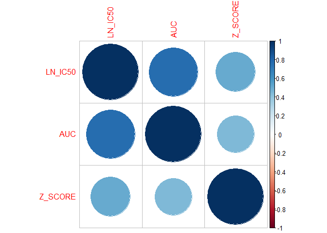<!-- -->

``` r
# boxplots of MSI status

msi_ln <- ggplot(data_c, aes(x = Microsatellite.instability.Status..MSI., y = LN_IC50)) +
  geom_boxplot() +
  theme_minimal() +
  labs(x = "MSI Status", y = "LN_IC50",
       title = "LN_IC50 across MSI groups")

msi_auc <- ggplot(data_c, aes(x = Microsatellite.instability.Status..MSI., y = AUC)) +
  geom_boxplot() +
  theme_minimal() +
  labs(x = "MSI Status", y = "AUC",
       title = "AUC across MSI groups")

msi_z <- ggplot(data_c, aes(x = Microsatellite.instability.Status..MSI., y = Z_SCORE)) +
  geom_boxplot() +
  theme_minimal() +
  labs(x = "MSI Status", y = "Z_SCORE",
       title = "Z_SCORE across MSI groups")

(msi_ln + msi_auc + msi_z) & theme(aspect.ratio = 1)
```

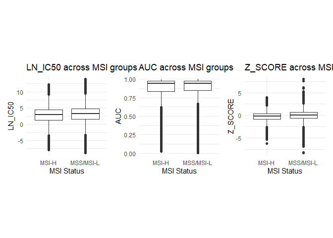<!-- -->

``` r
# boxplots of TARGET

unique(data_c$TARGET_PATHWAY)
```

    ##  [1] "DNA replication"                   "Mitosis"                          
    ##  [3] "Other"                             "EGFR signaling"                   
    ##  [5] "Apoptosis regulation"              "Chromatin histone acetylation"    
    ##  [7] "ABL signaling"                     "ERK MAPK signaling"               
    ##  [9] "PI3K/MTOR signaling"               "Genome integrity"                 
    ## [11] "Other, kinases"                    "Protein stability and degradation"
    ## [13] "RTK signaling"                     "Cell cycle"                       
    ## [15] "WNT signaling"                     "JNK and p38 signaling"            
    ## [17] "p53 pathway"                       "Cytoskeleton"                     
    ## [19] "IGF1R signaling"                   "Hormone-related"                  
    ## [21] "Chromatin histone methylation"     "Metabolism"                       
    ## [23] "Chromatin other"                   "Unclassified"

``` r
tp_ln <- ggplot(data_c, aes(x = TARGET_PATHWAY, y = LN_IC50)) +
  geom_boxplot() +
  theme_minimal() +
  labs(x = "Target Pathway", y = "LN_IC50",
       title = "LN_IC50 across Target Pathways")

tp_auc <- ggplot(data_c, aes(x = TARGET_PATHWAY, y = AUC)) +
  geom_boxplot() +
  theme_minimal() +
  labs(x = "Target Pathway", y = "AUC",
       title = "AUC across Target Pathways")

tp_z <- ggplot(data_c, aes(x = TARGET_PATHWAY, y = Z_SCORE)) +
  geom_boxplot() +
  theme_minimal() +
  labs(x = "Target Pathway", y = "Z_SCORE",
       title = "Z_SCORE across Target Pathways")

(tp_ln / tp_auc / tp_z) +
  plot_layout(heights = c(3, 3, 3)) &
  theme(
    axis.text.x = element_text(angle = 45, hjust = 1)
  )
```

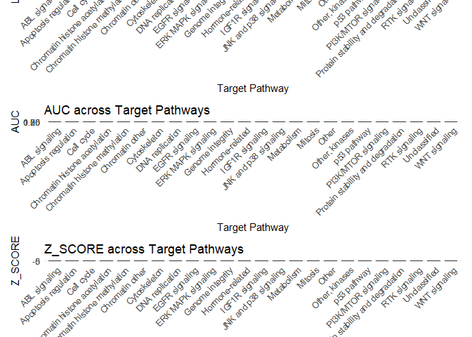<!-- -->

``` r
# boxplots of TCGA_DESC

unique(data_c$TCGA_DESC)
```

    ##  [1] "MB"            "UNCLASSIFIED"  "SKCM"          "BLCA"         
    ##  [5] "CESC"          "GBM"           "LUAD"          "LUSC"         
    ##  [9] "SCLC"          "MESO"          "NB"            "MM"           
    ## [13] "PAAD"          "ESCA"          "BRCA"          "HNSC"         
    ## [17] "KIRC"          "LAML"          "OV"            "PRAD"         
    ## [21] "COREAD"        "LCML"          "ALL"           "LGG"          
    ## [25] "UNCLASSIFIED1" "THCA"          "STAD"          "DLBC"         
    ## [29] "UCEC"          "LIHC"          "CLL"           "ACC"          
    ## [33] "OTHER"         "COAD/READ"

``` r
tcga_ln <- ggplot(data_c, aes(x = TCGA_DESC, y = LN_IC50)) +
  geom_boxplot() +
  theme_minimal() +
  labs(x = "Cancer Type", y = "LN_IC50",
       title = "LN_IC50 across Cancer Types")

tcga_auc <- ggplot(data_c, aes(x = TCGA_DESC, y = AUC)) +
  geom_boxplot() +
  theme_minimal() +
  labs(x = "Cancer Type", y = "AUC",
       title = "AUC across Cancer Types")

tcga_z <- ggplot(data_c, aes(x = TCGA_DESC, y = Z_SCORE)) +
  geom_boxplot() +
  theme_minimal() +
  labs(x = "Cancer Type", y = "Z_SCORE",
       title = "Z_SCORE across Cancer Types")

(tcga_ln / tcga_auc / tcga_z) +
  plot_layout(heights = c(3, 3, 3)) &
  theme(
    axis.text.x = element_text(angle = 45, hjust = 1)
  )
```

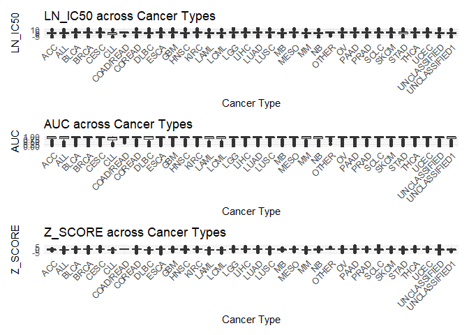<!-- -->

``` r
# histogram of numerical variables

par(mfrow = c(3, 1))
hist.data.frame(data_num)
```

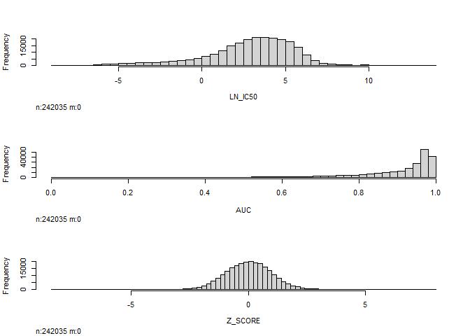<!-- -->

``` r
# looking at the histograms, AUC requires a transformation.

skewness(data_c$AUC)
```

    ## [1] -2.402334

``` r
auc_log <- data_c$AUC
auc_log <- pmin(pmax(auc_log, 0.001), 0.999) #log values 0 and 1 are undefined so we need to set a minimum and maximum
auc_trans <- log(auc_log / (1 - auc_log))
skewness(auc_trans)
```

    ## [1] -0.6787903

``` r
# centering and scaling new data frame of numerical predictor data with transformed values

data_numpred_trans <- data.frame(
  AUC_trans = auc_trans,
  Z_SCORE = data_c$Z_SCORE
)

par(mfrow = c(2, 1)) #draws 2 plots side by side 2 rows by 1 column
hist.data.frame(data_numpred_trans)
```

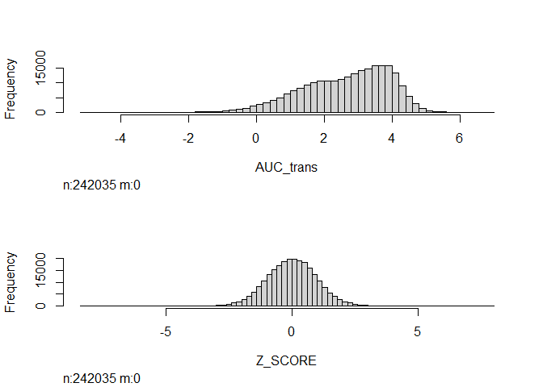<!-- -->

``` r
data_numpred_cs <- scale(data_numpred_trans)
```

``` r
# principal components analysis

data_num_pca <- prcomp(data_numpred_cs)
data_num_pca
```

    ## Standard deviations (1, .., p=2):
    ## [1] 1.2038637 0.7420998
    ## 
    ## Rotation (n x k) = (2 x 2):
    ##                 PC1        PC2
    ## AUC_trans 0.7071068 -0.7071068
    ## Z_SCORE   0.7071068  0.7071068

``` r
#how variance each PC contributes
exp_var <- (data_num_pca$sdev^2) / sum(data_num_pca$sdev^2)
exp_var
```

    ## [1] 0.7246439 0.2753561

``` r
#cumulatively adds how much each PC contributes till the value 1 is reached
data_ex_vratio <- cumsum(exp_var)
data_ex_vratio 
```

    ## [1] 0.7246439 1.0000000

``` r
par(pty = "s") #generate a square plot region s for square
plot(
  exp_var,
  type = "b", #draw both lines and points
  pch = 19, #use solid circles for the points
  xlab = "Principal Component",
  ylab = "Explained Variance Ratio",
  main = "Scree Plot"
)
```

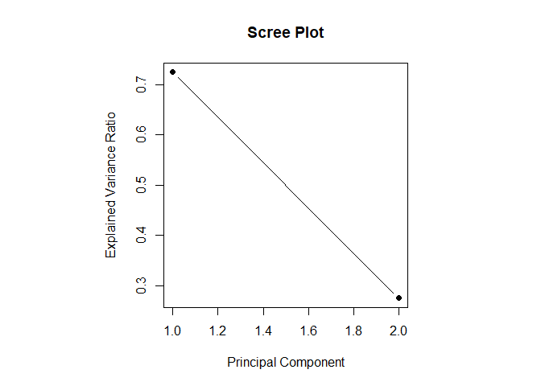<!-- -->

``` r
abs(data_num_pca$rotation[,1])
```

    ## AUC_trans   Z_SCORE 
    ## 0.7071068 0.7071068

``` r
sort(abs(data_num_pca$rotation[,1]), decreasing = TRUE)
```

    ##   Z_SCORE AUC_trans 
    ## 0.7071068 0.7071068

``` r
biplot(data_num_pca)
```

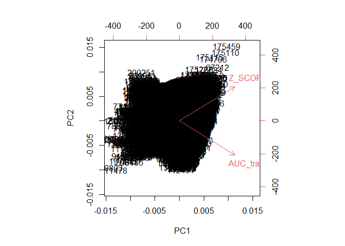<!-- -->

``` r
PC1 <- data_num_pca$x[,1]
cor.test(PC1, data_c$LN_IC50) #show PC 1 confidence interval roughly between 0.746 and 0.750
```

    ## 
    ##  Pearson's product-moment correlation
    ## 
    ## data:  PC1 and data_c$LN_IC50
    ## t = 555.13, df = 242033, p-value < 2.2e-16
    ## alternative hypothesis: true correlation is not equal to 0
    ## 95 percent confidence interval:
    ##  0.7466424 0.7501474
    ## sample estimates:
    ##       cor 
    ## 0.7484001

``` r
plot(
  PC1,
  data_c$LN_IC50,
  pch = 19,
  xlab = "PC1",
  ylab = "LN_IC50",
  main = "PC1 vs LN_IC50"
)
abline(lm(data_c$LN_IC50 ~ PC1), col = "red")
```

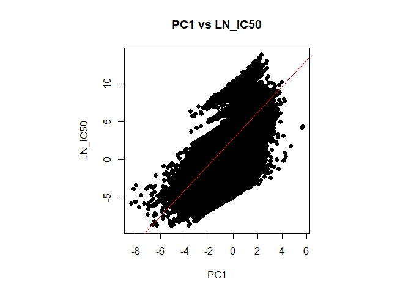<!-- -->

``` r
# the final cleaned, reduced, and transformed data set is data_f.
data_f <- data_c %>% select(-AUC)
str(data_f)
```

    ## 'data.frame':    242035 obs. of  10 variables:
    ##  $ CELL_LINE_NAME                         : chr  "PFSK-1" "ES5" "ES7" "EW-11" ...
    ##  $ TCGA_DESC                              : chr  "MB" "UNCLASSIFIED" "UNCLASSIFIED" "UNCLASSIFIED" ...
    ##  $ DRUG_NAME                              : chr  "Camptothecin" "Camptothecin" "Camptothecin" "Camptothecin" ...
    ##  $ LN_IC50                                : num  -1.46 -3.36 -5.04 -3.74 -5.14 ...
    ##  $ Z_SCORE                                : num  0.433 -0.6 -1.517 -0.807 -1.57 ...
    ##  $ GDSC.Tissue.descriptor.2               : chr  "medulloblastoma" "ewings_sarcoma" "ewings_sarcoma" "ewings_sarcoma" ...
    ##  $ Microsatellite.instability.Status..MSI.: chr  "MSS/MSI-L" "MSS/MSI-L" "MSS/MSI-L" "MSS/MSI-L" ...
    ##  $ Methylation                            : chr  "Y" "Y" "Y" "Y" ...
    ##  $ TARGET                                 : chr  "TOP1" "TOP1" "TOP1" "TOP1" ...
    ##  $ TARGET_PATHWAY                         : chr  "DNA replication" "DNA replication" "DNA replication" "DNA replication" ...

\#SAM

\#Since the models took an extremely long time to train due to the caret
package \#naturally encoding all your categorical variables to be dummy
variables, it was computationally expensive. \#Instead predictors like
CELL_LINE_NAME and DRUG_NAME are removed from the model to decrease
computation time \#and they did not provide predictive power

\#Seed is set. Split the data on cell line

``` r
seed <- 756
set.seed(seed)

#Target variable
IC50 <- data_f$LN_IC50

#Having just predictors in the data set
predictors <- data_f %>% select(-LN_IC50)

#Get unique cell lines
cell_lines_names <- unique(predictors$CELL_LINE_NAME)

#20 percent of the cell line names as left as test (splitting the data based on cell line name)
test_set_samples <- sample(cell_lines_names, size = floor(0.2 * length(cell_lines_names)))

testingRows <- predictors$CELL_LINE_NAME %in% test_set_samples

testPredictors <- predictors[testingRows,]
trainPredictors <- predictors[!testingRows,]

trainIC50 <- IC50[!testingRows]
testIC50  <- IC50[testingRows]

dim(trainPredictors)
```

    ## [1] 193302      9

``` r
dim(testPredictors)
```

    ## [1] 48733     9

``` r
length(trainIC50)
```

    ## [1] 193302

``` r
length(testIC50)
```

    ## [1] 48733

\#Encode – One hot encode all the predictor values manually (not through
caret model) \#that will be used for our model predictions

``` r
#Make variables from character to factor type for encoding 
trainPredictors$TARGET <- factor(trainPredictors$TARGET)
testPredictors$TARGET <- factor(testPredictors$TARGET,
                                levels = levels(trainPredictors$TARGET))

trainPredictors$TARGET_PATHWAY <- factor(trainPredictors$TARGET_PATHWAY)
testPredictors$TARGET_PATHWAY  <- factor(testPredictors$TARGET_PATHWAY,
                                         levels = levels(trainPredictors$TARGET_PATHWAY))

trainPredictors$Microsatellite.instability.Status..MSI. <- 
    factor(trainPredictors$Microsatellite.instability.Status..MSI.)

testPredictors$Microsatellite.instability.Status..MSI.  <- 
    factor(testPredictors$Microsatellite.instability.Status..MSI.,
           levels = levels(trainPredictors$Microsatellite.instability.Status..MSI.))
```

\#Encoding TARGET and TARGET_PATHWAY variables

``` r
target_encode_tr  <- model.matrix(~ TARGET - 1, data = trainPredictors)
target_encode_tst <- model.matrix(~ TARGET - 1, data = testPredictors)

pathway_encode_tr  <- model.matrix(~ TARGET_PATHWAY - 1, data = trainPredictors)
pathway_encode_tst <- model.matrix(~ TARGET_PATHWAY - 1, data = testPredictors)

#Line up columns for model testing
target_encode_tst  <- target_encode_tst[,  colnames(target_encode_tr),  drop = FALSE]
pathway_encode_tst <- pathway_encode_tst[, colnames(pathway_encode_tr), drop = FALSE]
```

\#Encoding TCGA_DESC variable

``` r
tissue_dummies <- dummyVars(~ TCGA_DESC, data = trainPredictors)
tissue_encode_tr  <- predict(tissue_dummies, trainPredictors)
tissue_encode_tst <- predict(tissue_dummies, testPredictors)
```

\#Same encoding process for GDSC Tissue Descriptor 2 as TCGA_DESC

``` r
gdsctd2_dummies <- dummyVars(~ GDSC.Tissue.descriptor.2, data = trainPredictors)
gdsctd2_encode_tr  <- predict(gdsctd2_dummies, trainPredictors)
gdsctd2_encode_tst <- predict(gdsctd2_dummies, testPredictors)
```

\#Encoding continuous variables

``` r
MSI_encode_tr <- as.numeric(trainPredictors$Microsatellite.instability.Status..MSI.)
MSI_encode_tst  <- as.numeric(testPredictors$Microsatellite.instability.Status..MSI.)

Zscore_encode_tr <- trainPredictors$Z_SCORE
Zscore_encode_tst <- testPredictors$Z_SCORE
```

``` r
trainEncodedPredictors <- data.frame(
  target_encode_tr,
  pathway_encode_tr,
  tissue_encode_tr,
  gdsctd2_encode_tr,
  MSI_encode_tr,
  Zscore_encode_tr
)

testEncodedPredictors <- data.frame(
  target_encode_tst,
  pathway_encode_tst,
  tissue_encode_tst,
  gdsctd2_encode_tst,
  MSI_encode_tst,
  Zscore_encode_tst
)
```

\#Have train and test sets have the same number of predictors

``` r
#Align columns for train and test
common_cols <- union(colnames(trainEncodedPredictors),
                     colnames(testEncodedPredictors))

#Add missing columns to training set
missing_train <- setdiff(common_cols, colnames(trainEncodedPredictors))
trainEncodedPredictors[, missing_train] <- 0

#Add missing columns to test set
missing_test <- setdiff(common_cols, colnames(testEncodedPredictors))
testEncodedPredictors[, missing_test] <- 0

#Reorder columns 
trainEncodedPredictors <- trainEncodedPredictors[, common_cols]
testEncodedPredictors  <- testEncodedPredictors[, common_cols]
```

``` r
#Set up cross validation 
threefoldCV <- trainControl(method = "cv", number = 3, allowParallel = TRUE)
fivefoldCV <- trainControl(method = "cv", number = 5, allowParallel = TRUE)
#repeatedSplits <- trainControl(method = "repeatedcv", number = 5, repeats = 3, allowParallel = TRUE)
```

``` r
#Getting rid of Z-score
trainEncodedPredictors <- trainEncodedPredictors %>% select(-Zscore_encode_tr)
testEncodedPredictors  <- testEncodedPredictors  %>% select(-Zscore_encode_tr)

#Sanity Check
dim(trainEncodedPredictors)
```

    ## [1] 193302    307

``` r
dim(testEncodedPredictors)
```

    ## [1] 48733   307

``` r
length(trainIC50)
```

    ## [1] 193302

\#Linear Regression use as a baseline

``` r
#Before model training we need to use parallel processing so the CPU can run models more quickly
num_cores <- detectCores() - 1             # Leave 1 core for background tasks
cl <- makeCluster(num_cores)
registerDoParallel(cl)


set.seed(seed)
lin_reg_baseline <- train(trainEncodedPredictors, trainIC50,
                 method = "lm",
                 trControl = fivefoldCV)
lin_reg_baseline
```

    ## Linear Regression 
    ## 
    ## 193302 samples
    ##    307 predictor
    ## 
    ## No pre-processing
    ## Resampling: Cross-Validated (5 fold) 
    ## Summary of sample sizes: 154640, 154642, 154642, 154642, 154642 
    ## Resampling results:
    ## 
    ##   RMSE      Rsquared   MAE     
    ##   1.653584  0.6426826  1.224508
    ## 
    ## Tuning parameter 'intercept' was held constant at a value of TRUE

``` r
saveRDS(lin_reg_baseline, "lin_reg_baseline.rds")

#Stop the parallel cluster when models are finished training
stopCluster(cl)
registerDoSEQ()
```

``` r
lin_reg_Imp <- varImp(lin_reg_baseline, scale = FALSE)
plot(lin_reg_Imp, top = 25)
```

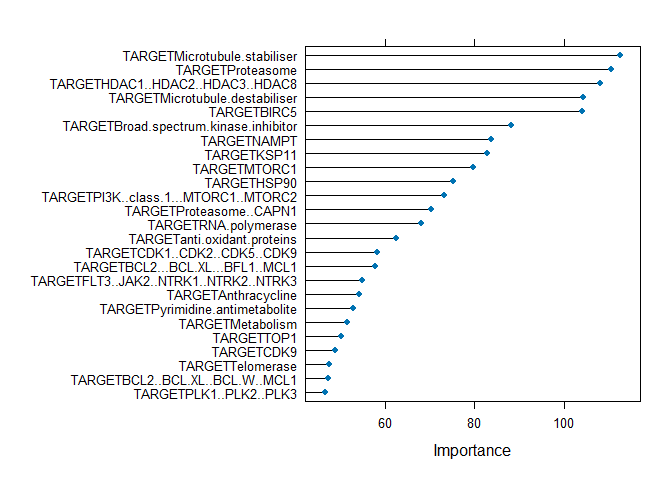<!-- -->

\#Important predictors that will be used for our other training models

``` r
important_feature_values <- lin_reg_Imp$importance$Overall
length(important_feature_values)
```

    ## [1] 263

``` r
names(important_feature_values) <- rownames(lin_reg_Imp$importance)
top25 <- sort(important_feature_values, decreasing = TRUE)[1:25]
top25
```

    ##          TARGETMicrotubule.stabiliser                      TARGETProteasome 
    ##                             112.40092                             110.36993 
    ##      TARGETHDAC1..HDAC2..HDAC3..HDAC8        TARGETMicrotubule.destabiliser 
    ##                             108.00324                             104.13600 
    ##                           TARGETBIRC5 TARGETBroad.spectrum.kinase.inhibitor 
    ##                             104.06877                              88.21251 
    ##                           TARGETNAMPT                           TARGETKSP11 
    ##                              83.72937                              82.79902 
    ##                          TARGETMTORC1                           TARGETHSP90 
    ##                              79.71496                              75.31399 
    ##  TARGETPI3K..class.1...MTORC1..MTORC2               TARGETProteasome..CAPN1 
    ##                              73.22679                              70.38685 
    ##                  TARGETRNA.polymerase           TARGETanti.oxidant.proteins 
    ##                              68.09185                              62.60265 
    ##          TARGETCDK1..CDK2..CDK5..CDK9      TARGETBCL2...BCL.XL...BFL1..MCL1 
    ##                              58.35016                              57.88667 
    ## TARGETFLT3..JAK2..NTRK1..NTRK2..NTRK3                   TARGETAnthracycline 
    ##                              54.93661                              54.29173 
    ##       TARGETPyrimidine.antimetabolite                      TARGETMetabolism 
    ##                              52.98479                              51.62183 
    ##                            TARGETTOP1                            TARGETCDK9 
    ##                              50.20081                              48.94199 
    ##                      TARGETTelomerase       TARGETBCL2..BCL.XL..BCL.W..MCL1 
    ##                              47.63532                              47.27223 
    ##                TARGETPLK1..PLK2..PLK3 
    ##                              46.70830

``` r
top25_cols <- names(sort(important_feature_values, decreasing = TRUE))[1:25]
top25_cols
```

    ##  [1] "TARGETMicrotubule.stabiliser"         
    ##  [2] "TARGETProteasome"                     
    ##  [3] "TARGETHDAC1..HDAC2..HDAC3..HDAC8"     
    ##  [4] "TARGETMicrotubule.destabiliser"       
    ##  [5] "TARGETBIRC5"                          
    ##  [6] "TARGETBroad.spectrum.kinase.inhibitor"
    ##  [7] "TARGETNAMPT"                          
    ##  [8] "TARGETKSP11"                          
    ##  [9] "TARGETMTORC1"                         
    ## [10] "TARGETHSP90"                          
    ## [11] "TARGETPI3K..class.1...MTORC1..MTORC2" 
    ## [12] "TARGETProteasome..CAPN1"              
    ## [13] "TARGETRNA.polymerase"                 
    ## [14] "TARGETanti.oxidant.proteins"          
    ## [15] "TARGETCDK1..CDK2..CDK5..CDK9"         
    ## [16] "TARGETBCL2...BCL.XL...BFL1..MCL1"     
    ## [17] "TARGETFLT3..JAK2..NTRK1..NTRK2..NTRK3"
    ## [18] "TARGETAnthracycline"                  
    ## [19] "TARGETPyrimidine.antimetabolite"      
    ## [20] "TARGETMetabolism"                     
    ## [21] "TARGETTOP1"                           
    ## [22] "TARGETCDK9"                           
    ## [23] "TARGETTelomerase"                     
    ## [24] "TARGETBCL2..BCL.XL..BCL.W..MCL1"      
    ## [25] "TARGETPLK1..PLK2..PLK3"

\#Train all features with reduced predictors

``` r
trainReduced <- trainEncodedPredictors[, top25_cols]
testReduced  <- testEncodedPredictors[, top25_cols]
```

\#Reduced Rows for computation speed

``` r
set.seed(seed)
row_reduction <- 0.15

trainEncoded_df <- trainEncodedPredictors %>%
  mutate(
    CELL_LINE_NAME = trainPredictors$CELL_LINE_NAME,
    IC50 = trainIC50
  )
trainReducedRows_df <- trainEncoded_df %>%
  group_by(CELL_LINE_NAME) %>%
  sample_frac(row_reduction) %>%
  ungroup()

trainReducedRows <- trainReducedRows_df[, top25_cols]
trainIC50ReducedRows <- trainReducedRows_df$IC50
```

``` r
testReduced2 <- testReduced
testIC50Reduced <- testIC50
```

``` r
#Before model training we need to use parallel processing so the CPU can run models more quickly
num_cores <- detectCores() - 1             # Leave 1 core for background tasks
cl <- makeCluster(num_cores)
registerDoParallel(cl)

lin_reg <- train(trainReducedRows, trainIC50ReducedRows,
                 method = "lm",
                 trControl = threefoldCV)
```

    ## Warning: Setting row names on a tibble is deprecated.

``` r
lin_reg
```

    ## Linear Regression 
    ## 
    ## 29054 samples
    ##    25 predictor
    ## 
    ## No pre-processing
    ## Resampling: Cross-Validated (3 fold) 
    ## Summary of sample sizes: 19369, 19369, 19370 
    ## Resampling results:
    ## 
    ##   RMSE     Rsquared   MAE     
    ##   2.05352  0.4488115  1.610474
    ## 
    ## Tuning parameter 'intercept' was held constant at a value of TRUE

``` r
saveRDS(lin_reg, "lin_reg_model.rds")
#Stop the parallel cluster when models are finished training
stopCluster(cl)
registerDoSEQ()
```

\#KNN regression

``` r
set.seed(seed)
#Before model training we need to use parallel processing so the CPU can run models more quickly
num_cores <- detectCores() - 1             # Leave 1 core for background tasks
cl <- makeCluster(num_cores)
registerDoParallel(cl)

knn <- train(trainReducedRows, trainIC50ReducedRows,
             method = "kknn",
             tuneGrid = data.frame(
             kmax = seq(1, 11, by = 2), 
             distance = 2,            
             kernel = "rectangular"           
             ),
             preProcess = c("center", "scale"),
             trControl = threefoldCV)
```

    ## Warning: Setting row names on a tibble is deprecated.

``` r
knn
```

    ## k-Nearest Neighbors 
    ## 
    ## 29054 samples
    ##    25 predictor
    ## 
    ## Pre-processing: centered (25), scaled (25) 
    ## Resampling: Cross-Validated (3 fold) 
    ## Summary of sample sizes: 19370, 19369, 19369 
    ## Resampling results across tuning parameters:
    ## 
    ##   kmax  RMSE      Rsquared   MAE     
    ##    1    2.394332  0.3759326  1.842999
    ##    3    2.211419  0.4241629  1.705650
    ##    5    2.118816  0.4294027  1.634800
    ##    7    2.151624  0.4268052  1.648598
    ##    9    2.110094  0.4372338  1.628662
    ##   11    2.110094  0.4372338  1.628662
    ## 
    ## Tuning parameter 'distance' was held constant at a value of 2
    ## Tuning
    ##  parameter 'kernel' was held constant at a value of rectangular
    ## RMSE was used to select the optimal model using the smallest value.
    ## The final values used for the model were kmax = 11, distance = 2 and kernel
    ##  = rectangular.

``` r
saveRDS(knn, "knn_model.rds")

#Stop the parallel cluster when models are finished training
stopCluster(cl)
registerDoSEQ()
```

``` r
plot(knn)
```

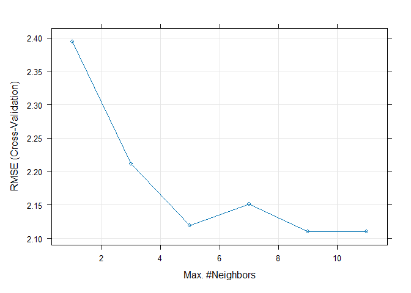<!-- -->

\#SVM

``` r
set.seed(seed)
#Before model training we need to use parallel processing so the CPU can run models more quickly
num_cores <- detectCores() - 1             # Leave 1 core for background tasks
cl <- makeCluster(num_cores)
registerDoParallel(cl)

svmGrid <- expand.grid(sigma = 10^seq(-2, 1, length = 4),
                       C = 10^seq(-2,1, length = 4))
SVM <- train(trainReducedRows, trainIC50ReducedRows,
             method = "svmRadial",
             tuneGrid = svmGrid,
             preProcess = c("center", "scale"),
             trControl = threefoldCV) 
```

    ## Warning: Setting row names on a tibble is deprecated.

``` r
SVM
```

    ## Support Vector Machines with Radial Basis Function Kernel 
    ## 
    ## 29054 samples
    ##    25 predictor
    ## 
    ## Pre-processing: centered (25), scaled (25) 
    ## Resampling: Cross-Validated (3 fold) 
    ## Summary of sample sizes: 19370, 19369, 19369 
    ## Resampling results across tuning parameters:
    ## 
    ##   sigma  C      RMSE      Rsquared   MAE     
    ##    0.01   0.01  2.209811  0.3649914  1.702166
    ##    0.01   0.10  2.063467  0.4454718  1.607981
    ##    0.01   1.00  2.064204  0.4464673  1.605621
    ##    0.01  10.00  2.064348  0.4465080  1.605605
    ##    0.10   0.01  2.217711  0.3581094  1.701364
    ##    0.10   0.10  2.064831  0.4448546  1.607713
    ##    0.10   1.00  2.064279  0.4464584  1.605535
    ##    0.10  10.00  2.064299  0.4465169  1.605534
    ##    1.00   0.01  2.217762  0.3580986  1.701403
    ##    1.00   0.10  2.064850  0.4448509  1.607713
    ##    1.00   1.00  2.064276  0.4464582  1.605533
    ##    1.00  10.00  2.064360  0.4465119  1.605541
    ##   10.00   0.01  2.217762  0.3580986  1.701403
    ##   10.00   0.10  2.064850  0.4448509  1.607713
    ##   10.00   1.00  2.064276  0.4464582  1.605533
    ##   10.00  10.00  2.064360  0.4465119  1.605541
    ## 
    ## RMSE was used to select the optimal model using the smallest value.
    ## The final values used for the model were sigma = 0.01 and C = 0.1.

``` r
saveRDS(SVM, "svm_model.rds")
#Stop the parallel cluster when models are finished training
stopCluster(cl)
registerDoSEQ()
```

``` r
target_microtibule_stabiliser <- tibble(target_microtibule_stabiliser = seq(min(trainReducedRows$TARGETMicrotubule.stabiliser),
                                     max(trainReducedRows$TARGETMicrotubule.stabiliser),
                                     length.out = 200))
```

``` r
make_prediction_grid <- function(var_name, train_reduced_data){
  
  # Since model has 25 predictors get the medians of the other 24
  #predictors to hold them constant so we can visualize the change of
  #target.microtibule_stabiliser 
  median_predictors <- as.list(apply(train_reduced_data, 2, median))
  
  # Dummy variable can only be 0 or 1
  dummy_vals <- c(0, 1)
  
  # Make a tibble data.frame with 200 rows and the median predictors
  SVM_tibble <- tibble()
  for (val in dummy_vals) {
    row <- median_predictors
    row[[var_name]] <- val
    SVM_tibble <- bind_rows(SVM_tibble, as_tibble(row))
  }
  
  SVM_tibble
}

prediction_grid <- make_prediction_grid(
  "TARGETMicrotubule.stabiliser",
  trainReducedRows
)
```

``` r
SVM_explore <- function(cost, sigma, grid, train_data, train_y) {
  
  # Fit an SVM with the given cost and sigma
  svmFit <- ksvm(
    x = as.matrix(train_data),
    y = train_y,
    kernel = "rbfdot",
    C = cost,
    kpar = list(sigma = sigma),
    scaled = TRUE
  )
  
  # Predict on the grid
  preds <- predict(svmFit, as.matrix(grid))
  
  tibble(
    TARGETMicrotubule.stabiliser = grid$TARGETMicrotubule.stabiliser,
    IC50_pred = preds,
    cost = cost,
    sigma = sigma
  )
}
```

``` r
best_sigma <- SVM$bestTune$sigma
cost_values <- 10^seq(-2, 1, length = 4)

cost_curves <- map_dfr(cost_values, function(c) {
  SVM_explore(c, best_sigma, prediction_grid, trainReducedRows, trainIC50ReducedRows)
})
```

``` r
ggplot(cost_curves,
       aes(x = TARGETMicrotubule.stabiliser, y = IC50_pred, color = factor(cost))) +
  geom_line(size = 1) +
  labs(color = "Cost")
```

    ## Warning: Using `size` aesthetic for lines was deprecated in ggplot2 3.4.0.
    ## ℹ Please use `linewidth` instead.
    ## This warning is displayed once per session.
    ## Call `lifecycle::last_lifecycle_warnings()` to see where this warning was
    ## generated.

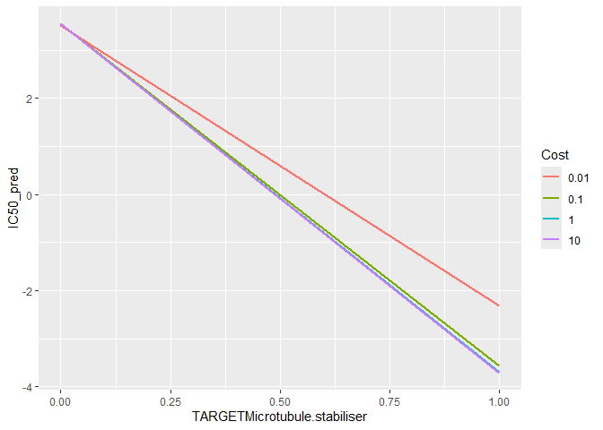<!-- -->

``` r
best_cost <- SVM$bestTune$C
sigma_values <- 10^seq(-2, 1, length = 4)

sigma_curves <- map_dfr(sigma_values, function(s) {
  SVM_explore(best_cost, s, prediction_grid, trainReducedRows, trainIC50ReducedRows)
})
```

``` r
ggplot(sigma_curves,
       aes(x = TARGETMicrotubule.stabiliser, y = IC50_pred, color = factor(sigma))) +
  geom_line(size = 1) +
  labs(color = "Sigma")
```

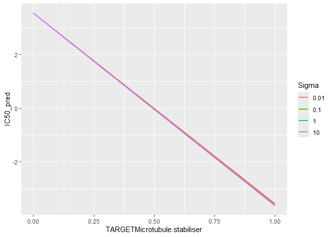<!-- -->

``` r
trainReducedRows_num <- data.frame(lapply(trainReducedRows, function(x) as.numeric(as.character(x))))
dim(trainReducedRows_num)
```

    ## [1] 29054    25

``` r
testReduced2_num <- data.frame(lapply(testReduced2, function(x) as.numeric(as.character(x))))
dim(testReduced2_num)
```

    ## [1] 48733    25

\#MARS

``` r
set.seed(seed)
#Before model training we need to use parallel processing so the CPU can run models more quickly
num_cores <- detectCores() - 1             # Leave 1 core for background tasks
cl <- makeCluster(num_cores)
registerDoParallel(cl)

MARSGrid <- expand.grid(degree = 1:2, nprune = 2:20)
MARS <- train(trainReducedRows_num, trainIC50ReducedRows,
              method ="earth",
              tuneGrid = MARSGrid,
              trControl = threefoldCV)
MARS
```

    ## Multivariate Adaptive Regression Spline 
    ## 
    ## 29054 samples
    ##    25 predictor
    ## 
    ## No pre-processing
    ## Resampling: Cross-Validated (3 fold) 
    ## Summary of sample sizes: 19370, 19369, 19369 
    ## Resampling results across tuning parameters:
    ## 
    ##   degree  nprune  RMSE      Rsquared    MAE     
    ##   1        2      2.698313  0.04827385  2.054189
    ##   1        3      2.647886  0.08349337  2.025803
    ##   1        4      2.607119  0.11145959  1.995701
    ##   1        5      2.558635  0.14419306  1.961911
    ##   1        6      2.520264  0.16966340  1.939590
    ##   1        7      2.478219  0.19714872  1.913128
    ##   1        8      2.435664  0.22445716  1.886234
    ##   1        9      2.397542  0.24854692  1.854689
    ##   1       10      2.380488  0.25920290  1.842927
    ##   1       11      2.350048  0.27805772  1.819082
    ##   1       12      2.314409  0.29973718  1.798023
    ##   1       13      2.284942  0.31744668  1.779470
    ##   1       14      2.258334  0.33323535  1.765319
    ##   1       15      2.232340  0.34849702  1.747099
    ##   1       16      2.208577  0.36229896  1.732135
    ##   1       17      2.185809  0.37537344  1.715383
    ##   1       18      2.157788  0.39129034  1.696094
    ##   1       19      2.137978  0.40241693  1.677865
    ##   1       20      2.120623  0.41210089  1.665360
    ##   2        2      2.698313  0.04827385  2.054189
    ##   2        3      2.647886  0.08349337  2.025803
    ##   2        4      2.607119  0.11145959  1.995701
    ##   2        5      2.558635  0.14419306  1.961911
    ##   2        6      2.520264  0.16966340  1.939590
    ##   2        7      2.478219  0.19714872  1.913128
    ##   2        8      2.435664  0.22445716  1.886234
    ##   2        9      2.397542  0.24854692  1.854689
    ##   2       10      2.380488  0.25920290  1.842927
    ##   2       11      2.350048  0.27805772  1.819082
    ##   2       12      2.314409  0.29973718  1.798023
    ##   2       13      2.284942  0.31744668  1.779470
    ##   2       14      2.258334  0.33323535  1.765319
    ##   2       15      2.232340  0.34849702  1.747099
    ##   2       16      2.208577  0.36229896  1.732135
    ##   2       17      2.185809  0.37537344  1.715383
    ##   2       18      2.157788  0.39129034  1.696094
    ##   2       19      2.137978  0.40241693  1.677865
    ##   2       20      2.120623  0.41210089  1.665360
    ## 
    ## RMSE was used to select the optimal model using the smallest value.
    ## The final values used for the model were nprune = 20 and degree = 1.

``` r
saveRDS(MARS, "MARS_model.rds")

#Stop the parallel cluster when models are finished training
stopCluster(cl)
registerDoSEQ()
```

``` r
plot(MARS)
```

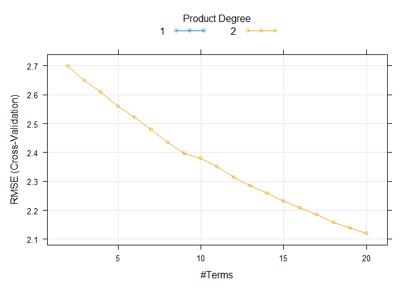<!-- -->

``` r
#set.seed(seed)
#MARSGrid2 <- expand.grid(degree = 1:4, nprune = 2:20)
#MARS2 <- train(trainEncodedPredictors, trainIC50,
#              method ="earth",
#              tuneGrid = MARSGrid2,
#              trControl = repeatedSplits)
#MARS2
```

\#Random Forest

``` r
set.seed(seed)
#Before model training we need to use parallel processing so the CPU can run models more quickly
num_cores <- detectCores() - 1             # Leave 1 core for background tasks
cl <- makeCluster(num_cores)
registerDoParallel(cl)

mtryGrid <- data.frame(
            mtry = c(1:10, 12, 15, 20))
rf <- train(trainReducedRows, trainIC50ReducedRows,
                method = "rf",
                tuneGrid = mtryGrid,
                ntree = 500,
                importance = TRUE,
                trControl = threefoldCV
            )
```

    ## Warning: Setting row names on a tibble is deprecated.

``` r
rf
```

    ## Random Forest 
    ## 
    ## 29054 samples
    ##    25 predictor
    ## 
    ## No pre-processing
    ## Resampling: Cross-Validated (3 fold) 
    ## Summary of sample sizes: 19370, 19369, 19369 
    ## Resampling results across tuning parameters:
    ## 
    ##   mtry  RMSE      Rsquared   MAE     
    ##    1    2.501349  0.4437202  1.955714
    ##    2    2.266072  0.4269098  1.808780
    ##    3    2.162290  0.4237983  1.727491
    ##    4    2.116892  0.4260619  1.683787
    ##    5    2.095386  0.4311440  1.662387
    ##    6    2.081023  0.4360455  1.646609
    ##    7    2.073599  0.4389629  1.637803
    ##    8    2.066979  0.4420235  1.629849
    ##    9    2.064013  0.4433854  1.625868
    ##   10    2.061964  0.4443725  1.623259
    ##   12    2.058249  0.4462489  1.618460
    ##   15    2.056193  0.4473211  1.615175
    ##   20    2.054799  0.4480460  1.612578
    ## 
    ## RMSE was used to select the optimal model using the smallest value.
    ## The final value used for the model was mtry = 20.

``` r
saveRDS(rf, "rf_model.rds")

#Stop the parallel cluster when models are finished training
stopCluster(cl)
registerDoSEQ()
```

``` r
plot(rf)
```

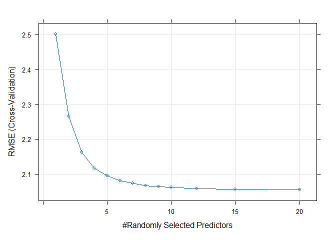<!-- -->

``` r
#Keep only the test rows whose cell lines were used in the reduced training set.
testResults_lin_regr <- predict(lin_reg, testReduced2)
testResults_knn_regr <- predict(knn, testReduced2)
testResults_SVM <- predict(SVM, testReduced2)
testResults_MARS <- predict(MARS, testReduced2_num)
testResults_rf <- predict(rf, testReduced2)

#Use postSample to evaluate the RMSE, Rsquared, and MAE
lin_regr_metrics  <- postResample(testResults_lin_regr, testIC50Reduced)
knn_regr_metrics  <- postResample(testResults_knn_regr, testIC50Reduced)
SVM_metrics  <- postResample(testResults_SVM, testIC50Reduced)
MARS_metrics <- postResample(testResults_MARS, testIC50Reduced)
rf_metrics   <- postResample(testResults_rf, testIC50Reduced)
```

``` r
#model results on y_test 
model_results <- cbind(
  Linear_Regression = lin_regr_metrics,
  Knn_Regression = knn_regr_metrics,
  SVM = SVM_metrics,
  MARS = MARS_metrics,
  Random_Forest = rf_metrics
)
model_results
```

    ##          Linear_Regression Knn_Regression       SVM      MARS Random_Forest
    ## RMSE             2.0396683      2.1946384 2.0511249 2.1108854      2.039713
    ## Rsquared         0.4481277      0.4345824 0.4450742 0.4089569      0.448075
    ## MAE              1.5993457      1.6798333 1.5966583 1.6511844      1.599758
